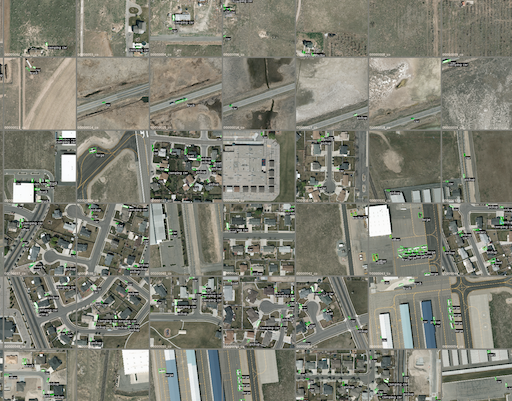
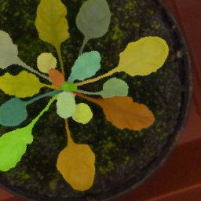
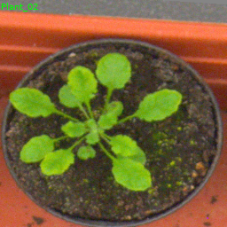
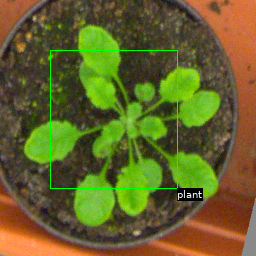

# ImageDatasetViz


<!-- [](https://travis-ci.org/vfdev-5/ImageDatasetViz) -->

<!-- [](https://coveralls.io/github/vfdev-5/ImageDatasetViz?branch=master) -->

Observe dataset of images and targets in few shots



## Descriptions

Idea is to create tools to store images, targets from a dataset as a few large images to observe the dataset
in few shots.


## Installation

#### with pip

```bash
 pip install image-dataset-viz
```

#### from sources
```bash
python setup.py install
```
or
```bash
pip install git+https://github.com/vfdev-5/ImageDatasetViz.git
```

## Usage

### Render a single datapoint

First, we can just take a look on a single data point rendering. Let's assume that we
have `img` as, for example, `PIL.Image` and `target` as acceptable target type (`str` or list of points or
`PIL.Image` mask, etc), thus we can generate a single image with target.

```python
from image_dataset_viz import render_datapoint

# if target is a simple label
res = render_datapoint(img, "test label", text_color=(0, 255, 0), text_size=10)
plt.imshow(res)

# if target is a mask image (PIL.Image)
res = render_datapoint(img, target, blend_alpha=0.5)
plt.imshow(res)

# if target is a bounding box, e.g. np.array([[10, 10], [55, 10], [55, 77], [10, 77]])
res = render_datapoint(img, target, geom_color=(255, 0, 0))
plt.imshow(res)
```

#### Example output on Leaf Segmentation dataset from CVPPP2017

    

### Export complete dataset
For example, we have a dataset of image files and annotations files (polygons with labels):
```python
img_files = [
    '/path/to/image_1.ext',
    '/path/to/image_2.ext',
    ...
    '/path/to/image_1000.ext',
]
target_files = [
    '/path/to/target_1.ext2',
    '/path/to/target_2.ext2',
    ...
    '/path/to/target_1000.ext2',
]
```
We can produce a single image composed of 20x50 small samples with targets to better visualize the whole dataset.
Let's assume that we do need a particular processing to open the images in RGB 8bits format:
```python
from PIL import Image

def read_img_fn(img_filepath):
    return Image.open(img_filepath).convert('RGB')
```
and let's say the annotations are just lines with points and a label, e.g. `12 23 34 45 56 67 car`
```python
from pathlib import Path
import numpy as np

def read_target_fn(target_filepath):
    with Path(target_filepath).open('r') as handle:
        points_labels = []
        while True:
            line = handle.readline()
            if len(line) == 0:
                break
            splt = line[:-1].split(' ')  # Split into points and labels
            label = splt[-1]
            points = np.array(splt[:-1]).reshape(-1, 2)
            points_labels.append((points, label))
    return points_labels
```
Now we can export the dataset
```python
de = DatasetExporter(read_img_fn=read_img_fn, read_target_fn=read_target_fn,
                     img_id_fn=lambda fp: Path(fp).stem, n_cols=20)
de.export(img_files, target_files, output_folder="dataset_viz")
```
and thus we should obtain a single png image with composed of 20x50 small samples.


## Examples

- [CIFAR10](examples/example_CIFAR10.ipynb)
- [VEDAI](examples/example_VEDAI.ipynb)

### Other basic examples

#### Image and Mask/BBox/Label

```python
import numpy as np
from image_dataset_viz import render_datapoint, bbox_to_points

img = ((0, 0, 255) * np.ones((256, 256, 3))).astype(np.uint8)
bbox = (
    (bbox_to_points((10, 12, 145, 156)), "A"),
    (bbox_to_points((109, 120, 215, 236)), "B"),
)

mask = 0 * np.ones((256, 256, 3), dtype=np.uint8)
mask[34:145, 56:123, :] = 255

res = render_datapoint(img, (mask, "mask", bbox), blend_alpha=0.5)
```


#### Image and Multi-Colored BBoxes

```python
import numpy as np
from image_dataset_viz import render_datapoint, bbox_to_points


img = ((0, 0, 255) * np.ones((256, 256, 3))).astype(np.uint8)

mask = 0 * np.ones((256, 256, 3), dtype=np.uint8)
mask[34:145, 56:123, :] = 255

targets = (
    (mask, {"blend_alpha": 0.6}),
    (
        (bbox_to_points((10, 12, 145, 156)), "A"),
        (bbox_to_points((109, 120, 215, 236)), "B"),
        {"geom_color": (255, 255, 0)}
    ),
    (bbox_to_points((129, 140, 175, 186)), "C"),
)

res = render_datapoint(img, targets, blend_alpha=0.5)
```


